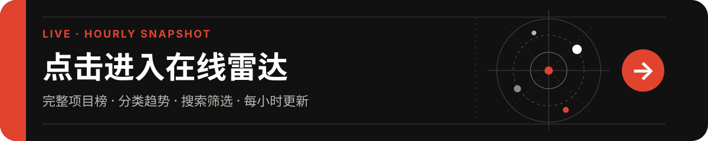
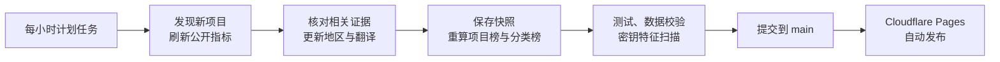

<h1 align="center">DeepSeek Harness 生态早期雷达</h1>

<p align="center">
  为一个正在形成中的开源生态，留下一份可复查、可回看、可继续生长的早期记录。
</p>

<p align="center">
  <a href="https://deepseek-harness-ecosystem-radar.pages.dev/" title="点击进入在线雷达">
    
  </a>
</p>

<p align="center">
  <strong>↑ 点击上方横幅，打开完整在线雷达</strong><br>
  <sub>完整项目榜 · 分类榜 · 趋势变化 · 搜索筛选 · 每小时更新</sub>
</p>

<p align="center">
  <a href="https://deepseek-harness-ecosystem-radar.pages.dev/"><strong>网页入口</strong></a> ·
  <a href="STATUS.md">最新快照</a> ·
  <a href="METHODOLOGY.md">数据方法</a> ·
  <a href="https://github.com/aaaaaaa-feng/deepseek-harness-ecosystem-radar/issues/new?template=add-project.yml">提交项目</a>
</p>

<p align="center">
  <a href="https://deepseek-harness-ecosystem-radar.pages.dev/"></a>
  <a href="https://github.com/aaaaaaa-feng/deepseek-harness-ecosystem-radar/actions/workflows/hourly-update.yml"></a>
  <a href="LICENSE"></a>
</p>

> [!IMPORTANT]
> **这不是实时行情系统。** GitHub Actions 每小时第 17 分钟尝试生成一次新快照，网页、状态页和数据文件都以“最近一次成功快照”为准。GitHub 调度延迟或任务失败时，会继续展示上一份有效数据，不会伪装成实时结果。

## 初衷

一个新技术生态刚刚出现时，最有价值的信息往往也是最容易消失的信息：谁最早开始尝试、项目从哪里涌现、哪些方向逐渐成形、关注度如何迁移，以及一些后来被视为理所当然的路线究竟在什么时候出现。

这些线索通常散落在 GitHub 搜索、README、社交媒体和零散讨论里。普通项目清单只能回答“现在有什么”，却很难回答“它是怎样变成今天这样的”。

DeepSeek Harness 生态早期雷达因此而生。它想做的不是又一份链接合集，也不是替项目评判优劣，而是把发布初期快速变化、容易被遗忘的公开信号，沉淀成一条有时间、有来源、有证据的观察序列。

> **把一次短暂的开源爆发，变成一份可以被后来者复盘的公共记录。**

## 它在回答什么

| 问题 | 雷达提供的视角 |
| --- | --- |
| 发布后出现了哪些实现型项目？ | 多组 GitHub 查询、创建时间过滤和 README 证据复核 |
| 当前哪些项目获得了更多公开关注？ | 基于 Stars 与 Forks 的可复算关注度排名 |
| 生态正在形成哪些方向？ | 按功能分类查看规模、项目数量和头部项目 |
| 哪些项目近期发生了变化？ | 使用真实快照间隔计算 Stars、Forks 与排名变化 |
| 项目是谁维护的？ | 展示维护者主动公开的 GitHub 所在地，不推断国籍 |
| 英文项目如何快速理解？ | 保留英文原文，并为可翻译内容提供中文辅助介绍 |

## 去哪里看最新数据

README 以长期有效的项目说明为主，只保留一个按小时更新的精简 Top 10；项目总数、完整排名和分类总量统一在在线雷达与数据文件中查看。

- [在线雷达](https://deepseek-harness-ecosystem-radar.pages.dev/)：搜索、筛选、完整项目榜、分类榜和观察窗口动量。
- [最新状态](STATUS.md)：最近一次成功快照的时间、规模和更新状态。
- [完整数据](data/latest.json)：网页使用的最新结构化数据。
- [项目排名 CSV](data/rankings.csv)：适合下载、复算和二次分析。
- [功能分类 CSV](data/categories.csv)：分类规模、增长和头部项目。
- [待复核候选](data/candidates.json)：相关性证据尚不充分、未进入正式榜单的项目。

## 每小时快照 · 关注度 Top 10

这一小段与在线雷达使用同一份小时快照。它不是实时榜单；任务延迟或失败时会保留上一份成功结果，并继续显示对应的数据时点。

<!-- RADAR_TOP10_START -->
**数据时点：** `2026-08-18T03:10:54.667Z`　·　**观察窗口：** 1.3 小时

| 排名 | 项目 | 分类 | Stars | Forks | 窗口 Stars Δ | 关注分 |
| ---: | --- | --- | ---: | ---: | ---: | ---: |
| 1 | [anywhere-labs/deepseek-harness-desktop](https://github.com/anywhere-labs/deepseek-harness-desktop) | 插件管理与生态工具 | 12062 | 548 | +211 | 367.89 |
| 2 | [awesome-dsh-plugin/awesome-dsh-plugin](https://github.com/awesome-dsh-plugin/awesome-dsh-plugin) | 其他实现型扩展 | 7768 | 1117 | +109 | 363.78 |
| 3 | [xiaobright/dsh-anchored-standard](https://github.com/xiaobright/dsh-anchored-standard) | 开发与质量工具 | 3447 | 103 | +17 | 308.14 |
| 4 | [Small-tailqwq/dsh-deep-whale](https://github.com/Small-tailqwq/dsh-deep-whale) | 界面与体验扩展 | 1266 | 43 | +10 | 266.5 |
| 5 | [dataelement/dsh-desktop](https://github.com/dataelement/dsh-desktop) | 桌面端与启动器 | 810 | 74 | +15 | 259.88 |
| 6 | [dsh-market/dsh-market](https://github.com/dsh-market/dsh-market) | 插件管理与生态工具 | 864 | 58 | +22 | 258.72 |
| 7 | [ysr666/dsh-vision-router](https://github.com/ysr666/dsh-vision-router) | 视觉与浏览器 | 653 | 30 | +14 | 241.83 |
| 8 | [zouyuxuan122/Deepseek-Harness-EAC](https://github.com/zouyuxuan122/Deepseek-Harness-EAC) | 桌面端与启动器 | 764 | 18 | +12 | 240.22 |
| 9 | [Electricitysheep/dsh-handbook](https://github.com/Electricitysheep/dsh-handbook) | 其他实现型扩展 | 458 | 21 | +5 | 226.6 |
| 10 | [myYangyunfan/dsh_desktop](https://github.com/myYangyunfan/dsh_desktop) | 桌面端与启动器 | 446 | 20 | +4 | 225.19 |
<!-- RADAR_TOP10_END -->

关注度只反映可公开复算的 GitHub 信号，不代表项目质量、安全性或真实用户数。[查看完整排名 →](https://deepseek-harness-ecosystem-radar.pages.dev/#ranking)

## 当前已经具备

- **项目发现**：持续发现最近创建的新仓库，并刷新既有项目的公开指标。
- **证据分层**：把项目分为已确认、待复核和排除，避免关键词命中直接变成事实。
- **项目与分类排名**：既看单个项目，也看生态方向的规模和变化。
- **独立滚动榜单**：完整排名收在固定高度的视窗中，不会把页面无限拉长。
- **真实窗口动量**：根据两个有效快照之间的真实时间差计算变化，不硬写“24 小时”。
- **开发者公开所在地**：只使用 GitHub 账号主动填写的 `location`，未知信息保持未知。
- **中文辅助介绍**：保留英文原文，增量翻译新增或发生变化的英文简介。
- **可审计数据**：保留 JSON、CSV、小时快照、每日归档和排除理由。
- **自动发布**：小时任务提交新快照后，Cloudflare Pages 自动发布最新页面。

## 更新方式



- 计划频率：每小时第 17 分钟，时区 `Asia/Shanghai`。
- 更新性质：**按小时生成的离散快照，不是实时流式数据**。
- 延迟处理：页面展示真实数据时点和真实观察窗口，不假设任务一定准点执行。
- 失败处理：API、翻译或校验失败时不提交半成品，继续保留上一份成功快照。
- 历史保留：保存最近 14 天的小时明细，并为每个上海日期保留一个长期日归档点。
- README 策略：小时任务只更新上方精简 Top 10；其余项目介绍保持稳定。

## 排名如何理解

关注度分数只使用可公开复算的 GitHub 快照指标：

```text
70 × log10(stars + 1) + 30 × log10(forks + 1)
```

对数缩放用于降低头部项目对榜单的绝对支配，权重表达“Stars 为主、Forks 为辅”的公开关注视角。这个分数不是产品质量、安全性、真实用户数或投资价值评分。

分类榜同样不使用不可解释的综合分，而是分别保留 Stars 总量、项目数量和真实观察窗口增长，让读者看到不同维度，而不是把所有判断压缩成一个数字。

## 证据、地区与翻译

### 项目相关性

- **已确认**：项目名称、描述、Topic 或 README 能证明其与 DeepSeek Harness 有直接实现关系。
- **待复核**：存在相关信号，但直接关系还不够清楚，不进入正式排名。
- **排除**：属于误命中、资料型内容、时间边界外项目或维护者明确排除项。

“已确认”只表示相关性证据成立，不代表本仓库已经逐个安装、完成代码审计或生产验收。

### 开发者所在地

“国内 / 中国港澳台 / 海外 / 未知”只来自维护者主动公开的 GitHub `location`。它描述的是账号公开地点，不代表国籍、团队成员构成或项目归属。`Earth`、`Remote`、空值和无法可靠识别的自由文本都会保留为“未知”。

### 中文辅助介绍

原文已有中文时直接展示；纯英文简介优先读取翻译缓存，只有新项目或原文变化时才请求翻译。模型不可用或配额不足不会阻断排名更新，页面会暂时展示英文并标记为待翻译。

## 数据目录

| 路径 | 内容 |
| --- | --- |
| `data/projects.json` | 已确认项目、证据和最新公开指标 |
| `data/candidates.json` | 等待人工复核的候选项目 |
| `data/exclusions.json` | 排除项目及其原因 |
| `data/developers.json` | 维护者公开地点和地区分组缓存 |
| `data/translations.json` | 英文原文与中文翻译缓存 |
| `data/snapshots/` | 最近 14 天的小时明细 |
| `data/archive/` | 每天一个长期归档点 |
| `data/rankings.json` / `.csv` | 项目排名与观察窗口变化 |
| `data/categories.json` / `.csv` | 功能分类榜与分类头部项目 |
| `docs/` | Cloudflare Pages 使用的静态页面 |
| `tweet-draft.md` | 随最新快照生成的 X/Twitter 草稿 |

## 手动补充与纠错

- 漏收但满足研究起点约束的项目：加入 `config/manual-allowlist.json`，或使用 [新增项目 Issue](https://github.com/aaaaaaa-feng/deepseek-harness-ecosystem-radar/issues/new?template=add-project.yml)。
- 明确误收的项目：加入 `config/manual-denylist.json`。
- 调整搜索范围：修改 `config/radar.json` 中的查询词与回看天数。

denylist 的优先级高于 allowlist。加入 denylist 后，下一次更新会从正式项目和候选项目中移除对应仓库，并保留排除原因。

<details>
<summary><strong>本地运行</strong></summary>

需要 Node.js 20 或更新版本；日常开发推荐使用 `.nvmrc` 指定的 Node.js 24。

```bash
npm ci
npm test
npm run build
npm run check
npm run security-check
```

在线刷新需要 GitHub API 访问：

```bash
GITHUB_TOKEN=... npm run update
```

如果 Token 没有 GitHub Models 权限，项目数据仍可更新，只是新增英文简介会保持待翻译状态。

</details>

<details>
<summary><strong>部署自己的副本</strong></summary>

1. Fork 本仓库，并允许 GitHub Actions 写入仓库内容。
2. 在 Cloudflare Pages 连接 Fork 后的仓库，生产分支选择 `main`。
3. 构建命令填写 `exit 0`，输出目录填写 `docs`，根目录留空。
4. 更新 `config/radar.json` 中的 `public_repository_url` 与 `public_site_url`。
5. 手动运行一次 `Hourly ecosystem update`，确认数据提交和自动部署成功。

GitHub Pages 仍可作为可选发布方式；它与 Cloudflare Pages 相互独立。

</details>

## 数据边界

- GitHub 搜索受索引、关键词、Topic、API 可见性和限额影响，不能证明绝对覆盖全网。
- Star、Fork 和排名变化是公开关注信号，不等于真实使用、留存、代码质量或安全性。
- 自动分类和证据判定是可复核规则，不是对项目的官方认证。
- 分类 Stars 总量可能被少数头部项目影响，应结合项目数量和头部项目一起阅读。
- GitHub `location` 可能为空、过期、玩笑化或代表组织办公地，不能据此判断国籍。
- 中文简介用于辅助阅读，不构成对项目功能声明的验证；英文原文仍是核对依据。
- 完整规则见 [METHODOLOGY.md](METHODOLOGY.md)。

## License

本仓库代码采用 [MIT License](LICENSE)。被观察项目各自保留自己的许可证与权利。
