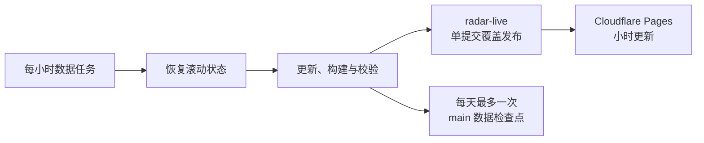

<h1 align="center">DeepSeek Harness 生态早期雷达</h1>

<strong>项目完成情况与部署验收</strong>

  <a href="https://deepseek-harness-ecosystem-radar.pages.dev/"><strong>在线雷达</strong></a> ·
  <a href="https://github.com/aaaaaaa-feng/deepseek-harness-ecosystem-radar">GitHub 仓库</a> ·
  <a href="https://github.com/aaaaaaa-feng/deepseek-harness-ecosystem-radar/actions/workflows/hourly-update.yml">每小时更新</a> ·
  <a href="README.md">项目说明</a>

> [!IMPORTANT]
> 截至 **2026-08-15**，公开仓库、每小时数据更新、Cloudflare Pages 独立网址和自动部署均已完成并验证。本文的数量是部署验收时快照；持续变化的最新数字请看 [STATUS.md](STATUS.md) 或在线页面。

## 交付结论

| 交付项 | 完成情况 | 状态 |
| --- | --- | :---: |
| 公开源码仓库 | `aaaaaaa-feng/deepseek-harness-ecosystem-radar`，MIT License | ✅ |
| 独立在线页面 | `deepseek-harness-ecosystem-radar.pages.dev`，不需要购买或绑定域名 | ✅ |
| 每小时数据更新 | GitHub Actions 每小时第 17 分钟运行 | ✅ |
| 自动发布 | `main` 有新提交后由 Cloudflare Pages 自动部署 | ✅ |
| 项目与分类排名 | 全量项目榜、9 类功能榜、真实窗口动量 | ✅ |
| 地区与中文简介 | 只采用公开地点；保留英文原文和翻译状态 | ✅ |
| 质量门禁 | 29 项测试、数据一致性检查、密钥特征扫描全部通过 | ✅ |

## 在线访问

- 页面：<https://deepseek-harness-ecosystem-radar.pages.dev/>
- 源码：<https://github.com/aaaaaaa-feng/deepseek-harness-ecosystem-radar>
- 自动更新：<https://github.com/aaaaaaa-feng/deepseek-harness-ecosystem-radar/actions/workflows/hourly-update.yml>

这个 `pages.dev` 地址由 Cloudflare 免费提供，和个人网站及 `xuefeng.me` 相互独立。本次没有改动个人网站域名、DNS 或个人简历站点。

## 部署验收时的数据

| 指标 | 结果 |
| --- | ---: |
| 已确认观察项目 | 1,295 |
| 待复核候选 | 149 |
| 功能分类 | 9 |
| 历史观察点 | 9 |
| 小时明细 | 8 |
| 每日归档 | 2 |
| 维护者公开账号 | 1,130 |
| 国内 / 中国港澳台 / 海外 / 未知 | 193 / 3 / 19 / 915 |
| 自动或缓存翻译 / 原文含中文 / 待翻译 | 27 / 493 / 646 |

> [!NOTE]
> “待复核”不会进入正式排名；“未知所在地”不会根据姓名、头像、邮箱或语言猜测。翻译失败也不会阻断排名更新，英文原文始终保留。

## 已完成的产品能力

| 模块 | 已完成内容 |
| --- | --- |
| **生态发现** | 多组 GitHub 查询、最近 7 天新项目发现、README 证据复核、候选与误命中隔离 |
| **项目主榜** | Stars/Forks 可复算关注分、真实窗口变化、排名变化、搜索与筛选 |
| **固定榜单视窗** | 全部项目收进独立滚动框，吸顶表头、可见名次、进度条和回到榜首 |
| **功能分类榜** | 9 类项目，支持 Stars 总量、项目数量和真实窗口增长三种视角 |
| **生态信号** | 最新抵达、最近推送、下一 Star 节点、项目方向分布 |
| **开发者地区** | 只读取维护者公开 `location`，保守分为国内、港澳台、海外和未知 |
| **中文简介** | 原文含中文直接展示；纯英文按缓存增量翻译，可展开核对英文原文 |
| **公开数据** | JSON、CSV、小时快照、每日归档、方法说明、状态页和推文草稿 |

## 每小时更新与自动发布

- 更新任务使用仓库自带的 `GITHUB_TOKEN`，无需公开保存个人 Token。
- 任务失败时不会提交半成品；每次运行有 15 分钟上限。
- 小时明细保留最近 14 天，每天另保留一个长期归档点。
- Cloudflare 生产分支为 `main`，构建命令为 `exit 0`，发布目录为 `docs`，根目录留空。
- Cloudflare 已开启生产自动部署；未来每次小时快照提交都会触发新部署。

## 实际验证记录

| 检查项 | 验证结果 | 状态 |
| --- | --- | :---: |
| GitHub 自动更新 | `github-actions[bot]` 已提交快照 `45bddb5` | ✅ |
| Cloudflare 首次生产部署 | 部署 `df9a50f5`，clone、build、deploy 全阶段成功 | ✅ |
| 公开页面 | 页面标题及项目榜、分类榜、动量、方向分布和方法模块均可加载 | ✅ |
| 自动化测试 | 29 项通过，0 失败 | ✅ |
| 数据一致性 | 1,295 个正式项目、149 个候选、9 个观察点校验通过 | ✅ |
| 密钥特征扫描 | 77 个文件扫描通过 | ✅ |
| 链接迁移 | 仓库地址已从旧用户名更新为 `aaaaaaa-feng` | ✅ |

## 主要交付物

| 文件 | 用途 |
| --- | --- |
| [README.md](README.md) | 对外项目首页、在线入口、当前排名和部署说明 |
| [docs/index.html](docs/index.html) | Cloudflare Pages 发布的静态可视化页面 |
| [data/latest.json](data/latest.json) | 网页使用的最新完整数据 |
| [data/rankings.json](data/rankings.json) / [CSV](data/rankings.csv) | 项目排名与窗口变化 |
| [data/categories.json](data/categories.json) / [CSV](data/categories.csv) | 功能分类榜与分类 Top 3 |
| [data/developers.json](data/developers.json) | 维护者公开地点与保守地区分组缓存 |
| [data/translations.json](data/translations.json) | 中文简介翻译缓存与原文对应关系 |
| [METHODOLOGY.md](METHODOLOGY.md) | 发现、证据、计分、快照和数据边界 |
| [STATUS.md](STATUS.md) | 每小时自动重建的最新运行状态 |
| [tweet-draft.md](tweet-draft.md) | 每小时自动重建、指向在线页面的发布草稿 |

## 数据边界

- GitHub 搜索结果受索引、关键词、Topic 和 API 可见性影响，不能声称绝对覆盖全网。
- Star、Fork 和排名变化是公开关注信号，不等于真实用户数、代码质量或安全性。
- 地区来自维护者主动公开的账户地点，不代表国籍、团队全部成员或项目归属。
- 中文简介用于辅助阅读，不构成对项目功能声明的验证；英文原文仍是核对依据。
- “已确认”只说明有公开的 DeepSeek Harness 相关证据，不代表已经逐个安装或完成安全审计。

## 可选的后续动作

- 使用 [tweet-draft.md](tweet-draft.md) 发布首条 X/Twitter 介绍。
- 根据数据积累增加 24 小时、7 天和里程碑回顾，但仍使用真实快照窗口。
- `design-demos/` 中保留三套视觉方向，可在以后单独选择是否升级正式页面。
- 自定义域名不是必需项；当前免费 `pages.dev` 地址可以长期直接访问。

---

  <strong>当前结论：项目已经公开上线，并具备每小时自动更新与自动发布能力。</strong>

---

## 2026-08-18 · 自动更新存储优化

随着项目规模扩大，旧方案把每小时生成的大量 JSON、CSV 和快照都提交到 `main`，两天内就产生了数十个自动提交。网站更新本身没有问题，但这会让代码历史持续膨胀，也会让真正的功能改动被自动数据提交淹没。

本次在不降低网站更新频率的前提下，重新拆分了“线上最新数据”和“长期审计记录”：

| 优化项 | 当前实现 | 状态 |
| --- | --- | :---: |
| 网站小时更新 | 每小时第 17 分钟刷新数据，并发布到 `radar-live` 生成分支 | ✅ 已实现 |
| `main` 提交频率 | 每个上海日期最多保存 1 个数据检查点，不再逐小时提交 | ✅ 已实现 |
| 在线分支历史 | `radar-live` 始终只保留 1 个受标记保护的生成提交 | ✅ 已实现 |
| 滚动状态 | GitHub Actions Cache 保存项目、候选、翻译和快照状态 | ✅ 已实现 |
| 小时明细 | 保留最近 3 天，过期后自动清理 | ✅ 已实现 |
| 每日归档 | 保留最近 90 天，过期后自动清理 | ✅ 已实现 |
| 页面数据体积 | 去掉重复的完整项目与信号对象，动量列表限制为前 100 条 | ✅ 已实现 |
| 发布安全 | 缺少生成分支标记时拒绝强制覆盖；测试或扫描失败时不发布 | ✅ 已实现 |

### 这次优化解决了什么

- 在线雷达仍然保持每小时更新，用户看到的功能和频率不降级。
- GitHub 仓库首页、源码提交和功能变更重新变得容易阅读。
- 自动生成数据不再无限堆积：小时层、日归档层和公开页面层都有明确上限。
- 既有历史提交不会被改写，避免破坏已经公开的链接和提交记录。

> [!NOTE]
> 本节记录的是 2026-08-18 的新架构。上方 2026-08-15 的部署记录保留作为历史验收证据，其中关于 `main` 小时提交和 14 天小时明细的描述已由本节取代。

  <strong>当前策略：网页每小时更新，main 每天最多一个检查点，生成数据按固定窗口滚动保留。</strong>

### 2026-08-18 · GitHub API 配额保护

首次真实运行新发布链路时，GitHub Actions 在刷新包含 4,781 个已确认项目的目录时返回 Installation API `remaining=0`。工作流按设计立即停止，未保存缓存、未发布 `radar-live`，也未向 `main` 写入半成品。

随后增加了配额内轮换机制：头部 200 个项目每轮优先刷新，其他项目按最久未检查顺序补足到每轮最多 1,000 个；开发者资料每轮最多处理 200 个，中文简介每轮最多翻译 24 条。新项目搜索仍保持每小时执行。这样既保留头部榜单的更新敏感度，也让长尾目录在后续轮次逐步覆盖，并为项目继续增长留出 API 与运行时间余量。

> [!IMPORTANT]
> “网站每小时更新”表示每小时生成并发布一份新快照，不表示对数千个仓库进行完全同步的同一时刻采样。README 和方法说明已公开写明这一边界。

### 2026-08-18 · 新发布架构线上验收

在 GitHub API 旧配额窗口结束后，使用合并后的限额与发布认证版本完成了一次真实的全链路运行。此次不是本地模拟：GitHub Actions、远端分支、Cloudflare 生产部署和公开网址均已分别回查。

| 验收项 | 实际结果 | 状态 |
| --- | --- | :---: |
| GitHub Actions | [运行 `32147909180`](https://github.com/aaaaaaa-feng/deepseek-harness-ecosystem-radar/actions/runs/32147909180) 全部步骤成功，耗时约 1 分钟 | ✅ |
| API 请求保护 | 计划上限 1,285 次；实际刷新 1,000 个已有仓库，其中头部 200 个优先 | ✅ |
| 滚动状态 | 运行前恢复缓存，更新后保存项目、候选、地区、翻译、小时明细和日归档 | ✅ |
| 小时发布分支 | `radar-live` 强制更新为单个根提交 `1dd6d57`，远端历史仍只有 1 条提交 | ✅ |
| `main` 控制 | 当天检查点已存在，小时数据提交步骤被跳过；`main` 保持在功能提交 `87f29d9` | ✅ |
| Cloudflare 生产分支 | 已从 `main` 切换为 `radar-live` | ✅ |
| Cloudflare 生产部署 | 部署 `a1cf2d18` 成功，生产分支和提交均与 `radar-live@1dd6d57` 一致 | ✅ |
| 公开主站 | 最新数据时间推进至 2026-08-18 22:22:31（Asia/Shanghai） | ✅ |

本次公开页面包含 4,871 个已确认观察项目和 444 个待复核候选。小时运行会优先刷新榜单头部，再轮换覆盖最久未检查的长尾项目；因此项目规模继续增长时，也不会重新回到“每小时请求全部仓库、每小时向 `main` 提交大文件”的旧模式。

> [!NOTE]
> 本轮 GitHub Models 返回计划中的 `retirement brownout`（HTTP 410），因此尝试的 24 条新增中文翻译没有写入缓存。已有中文原文和历史翻译仍正常展示，排名、地区、快照与生产发布均未受影响。该项记录为外部翻译服务可用性边界，不把失败结果写成已完成翻译。

  <strong>最终验收结论：网页继续按小时生成新快照，radar-live 始终只保留当前发布，main 每天最多一个数据检查点。</strong>

---

## 2026-08-19 · 仓库改名冲突自愈修复

GitHub 收件箱在当天连续收到 8 条 `Hourly ecosystem update` 失败通知。经回查，这不是 GitHub API 配额耗尽，也不是 Cloudflare 部署故障，而是一个项目在 GitHub 改名后触发了跨目录重名：

- 原仓库名：`under-the-ocean/cyrene-dsh-plugins`
- GitHub 返回的新仓库名：`under-the-ocean/dsh-plugin-cyrene`
- 正式项目缓存已被更新为新名称，但候选缓存中已经存在相同的新名称。
- 数据更新本身完成后，一致性检查发现“同一仓库同时属于正式项目和候选项目”，因此主动终止发布。

这说明原有安全门禁生效了：失败运行没有保存错误缓存、没有覆盖 `radar-live`，也没有把冲突数据发布到线上；公开网站在修复前继续使用上一份成功快照。

### 修复内容

| 修复项 | 当前行为 | 状态 |
| --- | --- | :---: |
| 正式项目与候选/排除项重名 | 自动保留正式项目，并移除较低优先级的重复项 | ✅ |
| 候选项目与排除项重名 | 自动保留候选项目，并移除旧排除记录 | ✅ |
| 历史来源 | 合并全部 `discovery_queries`，不丢失发现依据 | ✅ |
| 首次发现时间 | 保留冲突记录中最早的有效时间 | ✅ |
| 仓库数据 | Stars、证据等级和项目元数据仍以正式记录为准 | ✅ |
| 回归保护 | 新增仓库改名冲突与候选/排除冲突测试 | ✅ |

### 真实线上验收

| 验收项 | 实际结果 | 状态 |
| --- | --- | :---: |
| 修复 PR | [PR #8](https://github.com/aaaaaaa-feng/deepseek-harness-ecosystem-radar/pull/8) 的 Node 20、Node 24 与 Cloudflare Pages 检查全部通过 | ✅ |
| 每小时更新 | [运行 `32264092465`](https://github.com/aaaaaaa-feng/deepseek-harness-ecosystem-radar/actions/runs/32264092465) 全部步骤成功，耗时约 1 分 12 秒 | ✅ |
| 原故障检查点 | 数据刷新后的一致性检查与安全扫描均通过，不再出现目录重名错误 | ✅ |
| 小时发布分支 | `radar-live` 更新为单个根提交 `cc0fb65`，历史提交数仍为 1 | ✅ |
| Cloudflare 生产部署 | 部署 `b8054c0c` 成功，生产站点已读取新发布数据 | ✅ |
| 公开数据时间 | 2026-08-19 22:27:25（Asia/Shanghai） | ✅ |
| 最新公开规模 | 5,701 个已确认项目、507 个待复核候选 | ✅ |
| 改名项目去重 | `under-the-ocean/dsh-plugin-cyrene` 在公开正式排名中只出现 1 次 | ✅ |
| `main` 控制 | 当天检查点已经存在，因此本次小时运行按规则跳过新的 `main` 数据提交 | ✅ |

> [!NOTE]
> 收件箱里的旧失败通知属于历史记录，修复成功后不会自动消失；后续新运行已恢复成功。GitHub Models 的 HTTP 410 翻译服务降级仍是独立的非阻断问题，不影响发现、排名、快照和网站发布。

  <strong>修复结论：仓库改名导致的跨目录冲突已可自动自愈，每小时更新与 Cloudflare 发布链路已恢复。</strong>

